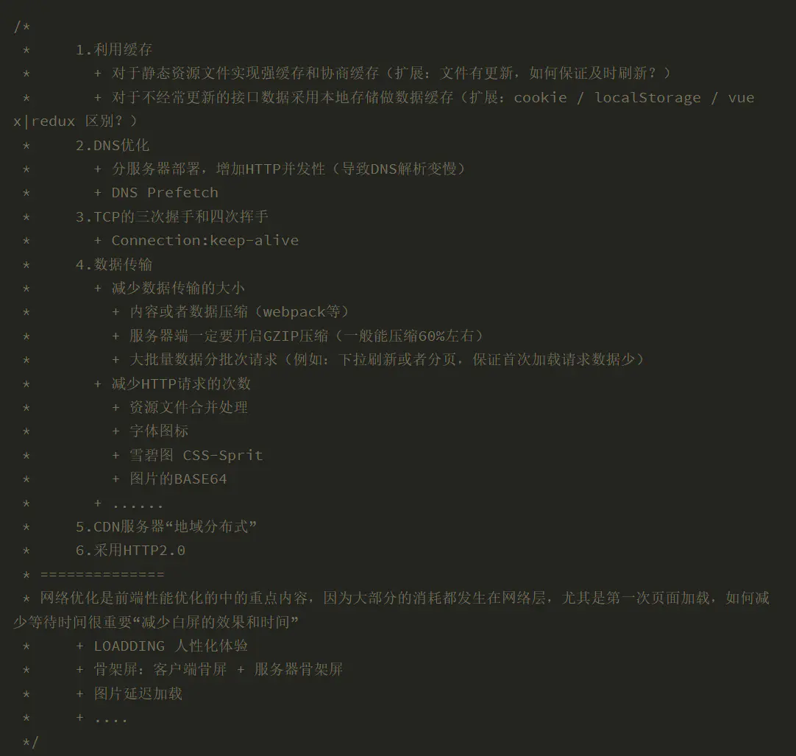

# **刷题部分：**基础知识


## var/let/const的区别及使用场景

var 

- var定义的变量会预解析，

  简单的说就是如果变量没有定义就直接使用的话，JavaScript回去解析这个变量，代码不会报错，只会输出undefined

  ```
  console.log(a)
  var a = 1 // undefined
  ```

- var定义的变量可以反复去定义，当然后面的会覆盖前面的

  ```
  var a = 1
  var a = 2 
  console.log(a) //2
  ```

- var在循环中使用的时候，循环体外依然可以使用

  ```
  for(var i = 0 ;i<5;i++){
      console.log(i)
  }
  console.log(i)  //5
  ```

- 在循环绑定事件过程中，var定义的变量无法保存，循环会在瞬间执行完

  ```
    var arrLi = document.getElementsByTagName('li')
          for(var i=0;i<arrLi.length;i++){
              arrLi[i].onclick = function () {
                  console.log(arrLi[i])// undefined 
              }
          }
  ```

- var 的声明作用域    函数作用域

  在函数内部定义一个var ，函数退出后就被销毁

let 

- let定义的变量不会预解析，必须先声明再使用，否则会报错

  ```
  console.log(a)
  let a = 1 // ReferenceError: Cannot access 'a' before initialization
  ```

- let不能定义已经定义过的变量（无论之前是用var定义的还是let或者const定义的）

  ```
   var a = 1
          let a = 2 
          console.log(a) //Uncaught SyntaxError: Identifier 'a' has already been declared
  ```

- let是块级作用域，函数内部使用let定义后，对函数外部无影响，简单说就是在一个{}里面生效

  ```
   for(let i = 0 ;i<5;i++){
              console.log(i)
          }
          console.log(i)  //err
  ```

- 4，由于let是块级作用域，在循环绑定事件过程中let会在这个循环中生效，再次循环时let会重新定义生效      块作用域是函数作用域的子集

  ```
   var arrLi = document.getElementsByTagName('li')
          for(let i=0;i<arrLi.length;i++){
              arrLi[i].onclick = function () {
                  console.log(arrLi[i])
              }
          }
  ```

const

- const定义的变量不会预解析，必须先声明再使用，否则会报错

  ```
  console.log(a)
  const a = 1 // ReferenceError: Cannot access 'a' before initialization
  ```

- const定义的变量不允许修  

  ```
  const a = 1 
  console.log(a)
  a = 5 //TypeError: Assignment to constant variable.
  ```

  - 但是在数组里面，const的值是允许被修改的，这是因为const存储的是地址，值的内容可以变化

    ```
    const arr1 = [1,2,3,4,5]
    arr1[3] = 100 
    console.log(arr1) //[ 1, 2, 3, 100, 5 ]
    ```

    

所有 总结就是

一般变量不变的 用const

for循环中用  let

反复定义用 var 


## 排序函数的应用 sort

```
let nums = [-1,0,1,2,-4,-3,0,4]

let num2 = nums.sort()
console.log(nums) //[-1, -3, -4, 0, 0,  1,  2, 4]

let num1 = nums.sort(function (a,b) {
    return a-b
})   //正确的对nums的排序 
console.log(nums) //[-4, -3, -1, 0, 0,  1,  2, 4]
console.log(num2,num1) //[ -4, -3, -1, 0,0,  1,  2, 4] [ -4, -3, -1, 0,0,  1,  2, 4]

```

使用排序算法的时候  调用改方法会改变原数组的顺序 


## js数组的基本操作 reduce

- js中统计数组中元素出现的个数

  ```
  function getNumCount(arr) {
      return arr.reduce((pre,cur)=>{
          console.log(pre,cur)
          if(cur in pre){
              pre[cur]++
          }else{
              pre[cur] = 1
          }
          return  pre
      },{})
  }
  console.log(getNumCount([1,2,2,2,3,4,5,5])) 
  ```

  - js 数组去重

    ```
    function unique(arr) {
        return arr.reduce((pre,cur)=>{
            console.log(pre,cur)
            if(!pre.includes(cur)){
                pre.push(cur)
            }
            return  pre
        },[])
    }
    console.log(unique([1,2,2,2,3,4,5,5])) 
    ```

    注意 判断数组中是否有固定的某个数的方式

    返回 true 或者false的是 array.includes(searcElement[,fromIndex])  ！！！！

    - 1. 判断数组中是否存在某个值，如果存在返回true，否则返回false

      ```
      var arr=[1,2,3,4];
      if(arr.includes(3))
          console.log("存在");
      else
          console.log("不存在");
      ```

    - 2 array.indexOf   此方法判断数组中是否存在某个值，如果存在，则返回数组元素的下标，否则返回-1。

      ```
      var arr=[1,2,3,4];
      var index=arr.indexOf(3); 
      console.log(index); // 2  返回的是下标！！
      var index1=arr.indexOf(7); 
      console.log(index1); // -1
      ```

    - 3：array.find(callback[,thisArg])

      返回数组中满足条件的第一个元素的值，如果没有，返回undefined

      ```
      var arr=[1,2,3,4];
      var result = arr.find(item =>{
          return item > 9
      });
      console.log(result); //undefined
      
      ```

    - array.findeIndex(callback[,thisArg])

      返回数组中满足条件的第一个元素的下标，如果没有找到，返回`-1`

      ```
      var arr=[1,2,3,4];
      var result = arr.findIndex(item =>{
          return item > 3
      });
      console.log(result);
      ```

    - ```
      var arr=[1,2,3,4];
      var result = arr.findIndex(item =>{
          return item > 3
      });
      console.log(result);
      ```

      

      

      

      

      

      

    

- 遍历数组

  简单的 for  forEach

  ```
  var num = [1,3,4,5,7,9]
  for(let i=0; i<num.length;i++){
       console.log(num[i])
  }
  console.log("下面是用的forEach函数")
  num.forEach(element => {
      console.log(element)
  });
  ```

- 过滤数组

  *function(currentValue, index,arr)*    

  | *currentValue* | 必须。当前元素的值           |
  | -------------- | ---------------------------- |
  | *index*        | 可选。当前元素的索引值       |
  | *arr*          | 可选。当前元素属于的数组对象 |

  ````
  let arr = [56, 15, 48, 3, 7];
  let newArr = arr.filter((currentValue)=>{    // 参数的设置  currentValue 是当前的值 
      return currentValue%2===0
  })
  console.log(newArr)
  ````

- 条件筛选

  for 循环   filter 都行吧 

- 条件求和

  同上

- 最值筛选

  法子  可多了  不局限 

  ```
  var a=[1,3,9,8,5];
  var i,result=0;
  for(i=0;i<a.length;i++)
  {
  result=Math.max(result,a[i]);
  }
  console.log(result);
  ```

- map方法  类似于reduce

  注意：： 一定是赋值给新的数组  而不是在原数组上改变

  ```
  let nums = [1,2,3]
  nums1 = nums.map((i)=>{return i+1})
  console.log(nums1)
  ```

  

## js 字符串切片成数组

```
let arr = '1 2 3 4 1 2'
let arre = arr.split(' ')

console.log(arre) //[ '1', '2', '3', '4', '1', '2' ]
```


## js  map set 基础知识

```
let set = new Set(['value1','value2','value3'])
let map = new Map([['key1','mapVal1'],['key2','mapVal2'],['key3','mapVal3']])
// map 与set 的循环遍历 
for(let value of set.values()){
    console.log(value)
}
for(let mapKeyValue of map){
 console.log(mapKeyValue)
}
for(let mapKey of map.keys()){
    console.log(mapKey)
}
for(let mapValue of map.values()){
    console.log(mapValue)
}
// map 与set 都有forEach
set.forEach((value,dupval)=>{
console.log(value,dupval)
})
map.forEach((key,value)=>{
    console.log(key,'--->',value)
})

// map 与set 都有.size属性！！
console.log('---------------size')
console.log(set.size)
console.log(map.size)

//转为数组
console.log([...set])
```

驼峰命名法：  复习 toUpperCase（）   toLowerCase（）

```
function transformStr ( str ) {
    const newStr = []
    for(let i=0;i<str.length;i++){
        if(str[i]=='-'){
            i = i+1
            newStr.push(str[i].toUpperCase())

        }else{
            newStr.push(str[i].toLowerCase())
        }
    }
    return newStr.join('')
}

var stringTuoFeng='Get-elEment-by-id';
console.log(transformStr(stringTuoFeng))
```


# 力扣刷题：

### 15 三数之和等于 0

思路： 三个指针  一个指向第一个数  另两个数去数组中找    乱序的数组的时候我们先排序 必然是 从前的数加从后的数才会是0的情况。

注意： 本题最大的问题在于 去重要考虑两个方面的去重   选定第一个数的时候要考虑去重  另外两个数在while循环的时候也要考虑去重     考虑到加法 两数相加时候一个数变了另一个数也一定会改变的  所以star++ end-- 一起是没有问题的

```
function threeSum(nums){
    nums.sort((a,b)=>{
        return a-b
    })

    let star,end
    const result = []
    for(let i=0;i<nums.length-2;i++){
        if(i===0 || nums[i]!==nums[i-1]){
            star = i+1
            end = nums.length -1
            while(star<end){
                if(nums[i]+nums[star]+nums[end]===0){
                    result.push([nums[i],nums[star],nums[end]])
                    star++
                    end--
                    while(star<end && nums[star]===nums[star-1]){
                        star++
                    }
                    while(star<end && nums[end]===nums[end+1]){
                        end--
                    }
                }else if(nums[i]+nums[star]+nums[end]>0){
                    end--
                }else{
                    star++
                }
            }
            
        }else{
            continue
        }
    }
    return result
}
let nums = [-1,0,1,2,-4,-3,0,4]
let result = threeSum(nums)
console.log(result)
```


### **49 题 字母 异位分组**

// 给定一个字符串数组，将字母异位词组合在一起。字母异位词指字母相同，但排列不同的字符串。

 ```
输入: ["eat", "tea", "tan", "ate", "nat", "bat"]
输出:
[
  ["ate","eat","tea"],
  ["nat","tan"],
  ["bat"]
]
 ```

解题思路 ：

1. 非暴力 但非最优      

   先把每一个元素都排序      然后匹配相同就好了

2. 优秀解法 

```
var groupAnagrams = function(strs) {
    if(strs.length === 0){
        return []
    }
    let map = new  Map()
    for(const str of strs){
        var temple =Array(26).fill(0)
        for(let i=0;i<str.length;i++){
            let asci_i = str.charCodeAt(i) - 97
            temple[asci_i]++
          
        }

        const key = temple.join(".")
        console.log(key)

        if(map.has(key)){
            map.set(key,[...map.get(key),str])
        }else{
            map.set(key,[str])
        }
    }

    const result = []
    for(const arr of map){
        result.push(arr[1])
    }

    return result
}; 

let strs =["bdddddddddd","bbbbbbbbbbc"]

// let strs = ["eat", "tea", "tan", "ate", "nat", "bat"]
// let strs = ["eat", "tea"]
console.log(groupAnagrams(strs))
```

### 54 螺旋矩阵

给你一个 `m` 行 `n` 列的矩阵 `matrix` ，请按照 **顺时针螺旋顺序** ，返回矩阵中的所有元素


```
输入：matrix = [[1,2,3],[4,5,6],[7,8,9]]
输出：[1,2,3,6,9,8,7,4,5]
```

```
var spiralOrder = function(matrix) {
    if(matrix.length ==0){
        return []
    }

    let left = 0,top=0,bottom=matrix.length-1,right=matrix[0].length-1

    let result = []
    direction = "right"

    while(left<=right && top<=bottom){
        if(direction == 'right'){
            for(let i=left;i<=right;i++){
                result.push(matrix[top][i])
            }
            top++
            direction = 'bottom'
        }
        else if(direction == 'bottom'){
            for(let i=top;i<=bottom;i++){
                result.push(matrix[i][right])
            }
            right--
            direction = 'left'
        }
        else if(direction == 'left'){
            for(let i=right;i>=left;i--){
                result.push(matrix[bottom][i])
            }
            bottom--
            direction = 'top'
        }
        else if(direction == 'top'){
            for(let i=bottom;i>=top;i--){
                result.push(matrix[i][left])
            }
            left++
            direction = 'right'
        }
    }
    return result
};

let matrix = [[1,2,3,4],[5,6,7,8],[9,10,11,12]]
console.log(spiralOrder(matrix))
```

### 55 跳跃游戏

给定一个非负整数数组 `nums` ，你最初位于数组的 **第一个下标** 。

数组中的每个元素代表你在该位置可以跳跃的最大长度。

判断你是否能够到达最后一个下标。

示例 1：

输入：nums = [2,3,1,1,4]
输出：true
解释：可以先跳 1 步，从下标 0 到达下标 1, 然后再从下标 1 跳 3 步到达最后一个下标。

##### ！！！ 动态规划

 ```
var canJump = function(nums) {
  if(nums.length==1)return false
  
  const dp = Array(nums.length-1).fill(false)
  console.log(dp)

  dp[0] = true

  for(let i=1 ;i<nums.length;++i){
      for(let j=i-1;j>=0;--j){
          if(!dp[j])continue
          if(nums[j]< i-j) continue
          dp[i]=true
          break
      }
  }
  return dp[nums.length-1]

};

// let nums = [2,3,1,1,4]
let nums = [3,2,1,0,4]
console.log(canJump(nums))
 ```

### 56合并区间

以数组 intervals 表示若干个区间的集合，其中单个区间为 intervals[i] = [starti, endi] 。请你合并所有重叠的区间，并返回一个不重叠的区间数组，该数组需恰好覆盖输入中的所有区间。

思路 ：先给所有的区间排序   然后 当一个区间的前一个值等与小于前一个区间   那就说明有重复的区域

```
var merge = function(intervals) {
    if(intervals.length<2) return intervals

    intervals.sort(function (a,b) {
        return a[0]-b[0]
    })

    let curr = intervals[0]
    let result = []
    
    for(let i=1; i<intervals.length; i++){
        if(curr[1]>=intervals[i][0]){
            curr[1] = Math.max(curr[1],intervals[i][1])
        }else{
            result.push(curr)
            curr = intervals[i]
        }
    }

    result.push(curr)
    return result
};

intervals = [[1,3],[2,6],[8,10],[15,18]]
console.log(merge(intervals))
```

### 62. 不同路径

一个机器人位于一个 m x n 网格的左上角 （起始点在下图中标记为 “Start” ）。机器人每次只能向下或者向右移动一步。机器人试图达到网格的右下角（在下图中标记为 “Finish” ）。问总共有多少条不同的路径？


```
输入：m = 3, n = 7
输出：28
```

##### ！！！动态规划

```
var uniquePaths = function(m, n) {
    let memo = Array()

    for(let i=0;i<m;i++){
        memo.push([])
    }

    for(let row=0;row<m;row++){
        memo[row][0] = 1
    }
    for(let col=0;col<n;col++){
        memo[0][col] = 1
    }

    for(let row=1 ;row<m;row++){
        for(let col=1 ; col<n; col++){
            memo[row][col] = memo[row-1][col]+memo[row][col-1]
        }
    }
    return memo[m-1][n-1]
};

const m = 3, n = 7
console.log(uniquePaths(m,n))
```


### 66 加一

给定一个由 整数 组成的 非空 数组所表示的非负整数，在该数的基础上加一。最高位数字存放在数组的首位， 数组中每个元素只存储单个数字。你可以假设除了整数 0 之外，这个整数不会以零开头。

```
输入：digits = [1,2,3]
输出：[1,2,4]
解释：输入数组表示数字 123。
```

```
var plusOne = function(digits) {
    for(let i=digits.length-1; i>=0; i--){
        if(digits[i]!=9){
            digits[i]++
            return digits
        }else{
            digits[i] = 0
        }
    }
    const result  = [1,...digits]
    //const result  = [1].concat(digits)
    return result
};
let digits = [9,9]
console.log(plusOne(digits))
```

### 70 爬楼梯

假设你正在爬楼梯。需要 *n* 阶你才能到达楼顶。

每次你可以爬 1 或 2 个台阶。你有多少种不同的方法可以爬到楼顶呢？

**注意：**给定 *n* 是一个正整数。

```
输入： 3
输出： 3
解释： 有三种方法可以爬到楼顶。
1.  1 阶 + 1 阶 + 1 阶
2.  1 阶 + 2 阶
3.  2 阶 + 1 阶
```

```
var climbStairs = function(n) {
    let memo = Array(n+1)
    memo[0] = 1
    memo[1] = 1
    for(let i=2; i<n+1; i++){
        memo[i] = memo[i-1] + memo[i-2]
    }
    return memo[n]
};

let n = 2
console.log(climbStairs(n))
```

### 930. 和相同的二元子数组

给你一个二元数组 `nums` ，和一个整数 `goal` ，请你统计并返回有多少个和为 `goal` 的 **非空** 子数组。

**子数组** 是数组的一段连续部分。

输入：nums = [1,0,1,0,1], goal = 2
输出：4
解释：
有 4 个满足题目要求的子数组：[1,0,1]、[1,0,1,0]、[0,1,0,1]、[1,0,1]

```
var numSubarraysWithSum = function(nums, goal) {
    let sum = 0
    let result = 0
    let preSum = []    
    for(let i = 0 ; i<nums.length+1 ;i++){
        preSum[i] = sum
        sum += nums[i]
        for(let j =0 ;j<i ;j++){
            if(preSum[i]-preSum[j] == goal){
                result +=1
            }
        }
    }
    return result
};

let nums = [0,0,0,0,0], goal = 0
console.log(numSubarraysWithSum(nums,goal))
```

### 17.10. 主要元素

数组中占比超过一半的元素称之为主要元素。给你一个 整数 数组，找出其中的主要元素。若没有，返回 -1 。请设计时间复杂度为 O(N) 、空间复杂度为 O(1) 的解决方案。

```
输入：[1,2,5,9,5,9,5,5,5]
输出：5
```

```
var majorityElement = function(nums) {
    if(nums.length == 0) return 0
    if(nums.length == 1) return nums[0]
    let map = new Map()
    let maxNum = Math.ceil(nums.length/2) , key = 0
    for(let i = 0 ; i<nums.length ; i++){
        key = nums[i]
        if(map.has(key)){
            map.set(key, map.get(key) + 1)
            if(map.get(key)>=maxNum){
                return key
            }
        }else{
            map.set(key,1)
        }
    }
    return -1
};

let nums = [1,2,5,9,5,9,5,5,5]
console.log(majorityElement(nums))
```

### 704 二分查找

```
输入: nums = [-1,0,3,5,9,12], target = 9
输出: 4
解释: 9 出现在 nums 中并且下标为 4
```

```
var search = function(nums, target) {
    
    let left = 0 ,right = nums.length -1
    let mid = 0
    while(left<=right){
        mid = Math.floor((right+left)/2)
        if(nums[mid] == target){
            return mid
        }else if(nums[mid] < target){
            left = mid+1
        }else if(nums[mid] > target){
            right = mid-1
        }
    }
    return -1
};

let nums = [5], target = 5
console.log(search(nums,target))
```

### 34. 在排序数组中查找元素的第一个和最后一个位置

给定一个按照升序排列的整数数组 `nums`，和一个目标值 `target`。找出给定目标值在数组中的开始位置和结束位置。

如果数组中不存在目标值 `target`，返回 `[-1, -1]`。

```
输入：nums = [5,7,7,8,8,10], target = 8
输出：[3,4]
```

```
var searchRange = function(nums, target) {
    const findLeft =function (nums,target){
        let left = 0 ,right = nums.length -1
        let mid = 0
    
        while(left<=right){
            mid = Math.floor((right+left)/2)
            if(nums[mid] == target){
                right = mid-1
            }else if(nums[mid] < target){
                left = mid+1
            }else if(nums[mid] > target){
                right = mid-1
            }
        }
        return left
    }

    let result = new Array(2)
    if(findLeft(nums,target)>=nums.length || nums[findLeft(nums,target)]!=target) {
        return [-1,-1]
    }
    else{
        result=[findLeft(nums,target),findLeft(nums,target+1)-1]
    }

    return result
};

let nums = [5,7,7,8,8,10], target = 8
console.log(searchRange(nums,target))
```

73 矩阵置0

给定一个 `*m* x *n*` 的矩阵，如果一个元素为 **0** ，则将其所在行和列的所有元素都设为 **0** 。请使用 **[原地](http://baike.baidu.com/item/原地算法)** 算法**。**


```
输入：matrix = [[1,1,1],[1,0,1],[1,1,1]]
输出：[[1,0,1],[0,0,0],[1,0,1]]
```

思路：

```
var setZeroes = function(matrix) {
    let firstColHasZero = []
    let firstRowHasZero = []
    for(let i=0;i<matrix.length;i++){  //行数 
        if(matrix[i][0]==0){
            firstRowHasZero.push(i)
        }
    }
    console.log(firstRowHasZero)

    for(let i=0;i<matrix[0].length;i++){ //列数
        if(matrix[0][i]==0){
            firstColHasZero.push(i)
        }
    }

    console.log(firstColHasZero)

    for(let row = 1; row <matrix.length ;row++){
        for(let col = 1; col<matrix[0].length ;col++){
            if(matrix[row][col]==0){
                matrix[0][col] = 0
                matrix[row][0] = 0
            }
        }
    }


    for(let row = 1; row <matrix.length ;row++){
        for(let col = 1; col<matrix[0].length ;col++){
            if(matrix[row][0]==0 || matrix[0][col]==0){
                matrix[row][col] = 0
            }
        }
    }


    //如果有行有为0 的数  那么 把该 行 列 变成0 
    if(firstRowHasZero.length>0 ){
        for(let i=0;i<firstRowHasZero.length;i++){
            //取出 行  为0 的位置 
            for(let row = 0; row <matrix.length ;row++){    
                matrix[row][0] = 0
            }
            for(let col = 0; col<matrix[0].length ;col++){
                matrix[firstRowHasZero[i]][col] = 0
            }
        }
    }
   console.log(matrix)

   if(firstColHasZero.length>0){
    for(let i=0;i<firstColHasZero.length;i++){  
            for(let row = 0; row <matrix.length ;row++){
                matrix[row][firstColHasZero[i]] = 0
            }
            for(let col = 0; col<matrix[0].length ;col++){
                matrix[0][col] = 0
            }
        }
    }
    return matrix
}

let matrix = [[1,0]]

console.log(setZeroes(matrix))
```

### 121.买卖股票的最佳时机

```
输入：[7,1,5,3,6,4]
输出：5
解释：在第 2 天（股票价格 = 1）的时候买入，在第 5 天（股票价格 = 6）的时候卖出，最大利润 = 6-1 = 5 。
     注意利润不能是 7-1 = 6, 因为卖出价格需要大于买入价格；同时，你不能在买入前卖出股票。
```

minPrice的作用：必然是用当前的值减去前面最低的值用于更新，所以取一个变量存储前面的最小值。

Math.max(result,prices[i]-minPrice)如果出现 [3,7,1,2]这种情况，就需要比较两个上升的段哪一段利润最大。

```
var maxProfit = function(prices) {
    let minPrice = prices[0]
    let result = 0
    for(let i = 0; i<prices.length; i++){
        minPrice = Math.min(minPrice,prices[i])
        result = Math.max(result,prices[i]-minPrice)
    }
    return result
};

let prices = [1,2]
console.log(maxProfit(prices))
```

### 122. 买卖股票的最佳时机 II

给定一个数组 prices ，其中 prices[i] 是一支给定股票第 i 天的价格。设计一个算法来计算你所能获取的最大利润。你可以尽可能地完成更多的交易（多次买卖一支股票）。注意：你不能同时参与多笔交易（你必须在再次购买前出售掉之前的股票）。

输入: prices = [7,1,5,3,6,4]
输出: 7
解释: 在第 2 天（股票价格 = 1）的时候买入，在第 3 天（股票价格 = 5）的时候卖出, 这笔交易所能获得利润 = 5-1 = 4 。
     随后，在第 4 天（股票价格 = 3）的时候买入，在第 5 天（股票价格 = 6）的时候卖出, 这笔交易所能获得利润 = 6-3 = 3 。

及其简单的算法：

求！！求所有增长趋势的利润！！！

```
var maxProfit = function(prices) {
    let profit = 0
    for(let i = 0; i<prices.length; i++){
      if(prices[i]<prices[i+1]){
          profit += prices[i+1]-prices[i]
      }
    }
    return profit
};

let prices =  [7,1,5,3,6,4]
console.log(maxProfit(prices))
```

### 152.含负数的乘积最大序列

.给你一个整数数组 `nums` ，请你找出数组中乘积最大的连续子数组（该子数组中至少包含一个数字），并返回该子数组所对应的乘积。

**示例 1:**

```
输入: [2,3,-2,4]
输出: 6
解释: 子数组 [2,3] 有最大乘积 6。
```

```
var maxProduct = function(nums) {
    let Maxpro = []
    let Minpro = []
    Maxpro[0] = nums[0]
    Minpro[0] = nums[0]
    max = nums[0]
    for(let i=1;i<nums.length;i++){
        Maxpro[i] = Math.max(nums[i],nums[i]*Maxpro[i-1],nums[i]*Minpro[i-1])
        Minpro[i] = Math.min(nums[i],nums[i]*Maxpro[i-1],nums[i]*Minpro[i-1])
        max = Math.max(max,Maxpro[i])
    }
    return max
};
var nums = [2,3,-2,4]
console.log(maxProduct(nums))
```

### 153.寻找排序数组中的最小值

已知一个长度为 n 的数组，预先按照升序排列，经由 1 到 n 次 旋转 后，得到输入数组。例如，原数组 nums = [0,1,2,4,5,6,7] 在变化后可能得到：
若旋转 4 次，则可以得到 [4,5,6,7,0,1,2]
若旋转 7 次，则可以得到 [0,1,2,4,5,6,7]
注意，数组 [a[0], a[1], a[2], ..., a[n-1]] 旋转一次 的结果为数组 [a[n-1], a[0], a[1], a[2], ..., a[n-2]] 。

给你一个元素值 互不相同 的数组 nums ，它原来是一个升序排列的数组，并按上述情形进行了多次旋转。请你找出并返回数组中的 最小元素 。

```
输入：nums = [2,3,4,5,1]
输出：1
```

基本思路： 因为原本就是 排序的数组，截断之后拼接，必然是拼接到后面的第一个数是小于前部分的最后一个数的，如果找到相邻的两个数，判断大小就可判断

```
var findMin = function(nums) {
    if(nums.length ===1){
        return nums[0]
    }
    let left = 0,right= nums.length-1
    if(nums[right]>nums[0]){
        return nums[0]
    }
    let mid = 0
    while(left<right){
        console.log(left,right)
        mid = Math.floor((left+right)/2)
        if(nums[mid]>nums[mid+1]){
            return nums[mid+1]
        }
        if(nums[mid-1]>nums[mid]){
            return nums[mid]
        }
        if(nums[mid]>nums[left]){
            left = mid
        }else{
            right = mid
        }
    }
};

var nums = [2,3,4,5,1]
console.log(findMin(nums))
```

### 187重复的DNA序列

所有 DNA 都由一系列缩写为 'A'，'C'，'G' 和 'T' 的核苷酸组成，例如："ACGAATTCCG"。在研究 DNA 时，识别 DNA 中的重复序列有时会对研究非常有帮助。

编写一个函数来找出所有目标子串，目标子串的长度为 10，且在 DNA 字符串 s 中出现次数超过一次。

```
输入：s = "AAAAACCCCCAAAAACCCCCCAAAAAGGGTTT"
输出：["AAAAACCCCC","CCCCCAAAAA"]
```

思路： 合理的运用map来存储我们找到的子串，并且让改子串作为key

写两种方法  

```
var findRepeatedDnaSequences = function(s) {
    const map = new Map()
    let result = []
    for(let i=0;i<=s.length-10;i++){
        console.log(i)
        let subDNA = s.substring(i,i+10)
        console.log(subDNA)
        if(map.has(subDNA)){
            map.set(subDNA,map.get(subDNA)+1)
        }else{
            map.set(subDNA,1)
        }
    }
    map.forEach(function(value,key){
        if(value>1){
            result.push(key)
        }
    });
    return result
};

var findRepeatedDnaSequences = function(s) {
    const map = new Map()
    let result = []
    for(let i=0;i<=s.length-10;i++){
        console.log(i)
        let subDNA = s.substring(i,i+10)
        console.log(subDNA)
        if(!map.has(subDNA)){
            map.set(subDNA,1)
        }else if(map.get(subDNA)===1){
            map.set(subDNA,2)
            result.push(subDNA)
        }else if(map.get(subDNA)>1){
            map.set(subDNA,map.get(subDNA)+1)
        }
    }
    return result
};
let s = "AAAAACCCCCAAAAACCCCCCAAAAAGGGTTT"

console.log(findRepeatedDnaSequences(s))
```

### 198打家劫舍

你是一个专业的小偷，计划偷窃沿街的房屋。每间房内都藏有一定的现金，影响你偷窃的唯一制约因素就是相邻的房屋装有相互连通的防盗系统，如果两间相邻的房屋在同一晚上被小偷闯入，系统会自动报警。

给定一个代表每个房屋存放金额的非负整数数组，计算你 不触动警报装置的情况下 ，一夜之内能够偷窃到的最高金额。

```
输入：[1,2,3,1]
输出：4
```

```
var rob = function(nums) {
    if(nums.length===1) return nums[0]
    if(nums.length===2) return  Math.max(nums[1],nums[0])
    let dp = new Array(nums.length-1)
    dp[0] = nums[0]
    dp[1] = Math.max(nums[1],nums[0])
    for(let i=2;i<nums.length;i++){
        dp[i] = Math.max(nums[i]+dp[i-2],dp[i-1])
    }
    return dp[nums.length-1]
};

let nums = [2,7,9,3,1]
console.log(rob(nums))
```

### 213. 打家劫舍 II

你是一个专业的小偷，计划偷窃沿街的房屋，每间房内都藏有一定的现金。这个地方所有的房屋都 围成一圈 ，这意味着第一个房屋和最后一个房屋是紧挨着的。同时，相邻的房屋装有相互连通的防盗系统，如果两间相邻的房屋在同一晚上被小偷闯入，系统会自动报警 。

给定一个代表每个房屋存放金额的非负整数数组，计算你 在不触动警报装置的情况下 ，今晚能够偷窃到的最高金额。

```
输入：nums = [2,3,2]
输出：3
解释：你不能先偷窃 1 号房屋（金额 = 2），然后偷窃 3 号房屋（金额 = 2）, 因为他们是相邻的。
```

思路:  只有两种情况  就是 要第一家不要最后一家   和 不要第一家要最最后一家，取这两种情况中最佳的一种

```
var rob = function(nums) {
  let len = nums.length
    if(nums.length===1) return nums[0]
    if(nums.length===2) return  Math.max(nums[1],nums[0])

    function subRob(nums,star,end) {
        let dp = new Array(len)
        dp[star] = nums[star]
        dp[star+1] = Math.max(dp[star],nums[star+1])
        for(let i=star+2;i<=end;i++){
            dp[i] = Math.max(dp[i-1],dp[i-2]+nums[i])
        }
        return dp[end]
    } 

    return Math.max(subRob(nums,0,len-2),subRob(nums,1,len-1))
};
```

### 200. 岛屿数量

给你一个由 '1'（陆地）和 '0'（水）组成的的二维网格，请你计算网格中岛屿的数量。

岛屿总是被水包围，并且每座岛屿只能由水平方向和/或竖直方向上相邻的陆地连接形成。

此外，你可以假设该网格的四条边均被水包围。

```
输入：grid = [
  ["1","1","0","0","0"],
  ["1","1","0","0","0"],
  ["0","0","1","0","0"],
  ["0","0","0","1","1"]
]
输出：3
```

```
var numIslands = function(grid) {
    let count = 0

    function dfs(row,col) {
        if(row<0 || col<0 || row>=grid.length || col>=grid[0].length || grid[row][col]==='0'){
            return
        }
        grid[row][col] = '0'
        dfs(row+1,col)
        dfs(row-1,col)
        dfs(row,col+1)
        dfs(row,col-1)
    }

    for(let row = 0; row<grid.length; row++){
        for(let col = 0; col<grid[0].length; col++){
            if(grid[row][col]==='1'){
                count +=1
                console.log(row,col)
                dfs(row,col)
            }
        }
    }
    return count
};

let grid = [["1","1","0","0","0"],
            ["1","1","0","0","0"],
            ["0","0","1","0","0"],
            ["0","0","0","1","1"]]
 console.log(numIslands(grid))
```

### 217. 存在重复元素

给定一个整数数组，判断是否存在重复元素。

如果存在一值在数组中出现至少两次，函数返回 `true` 。如果数组中每个元素都不相同，则返回 `false` 。

```
输入: [1,2,3,1]
输出: true
```

```
var containsDuplicate = function(nums) {
    let set = new Set()//也可以用map  但是set更省时
    for(let i=0 ; i<nums.length ; i++){
        if(set.has(nums[i])){
            return true
        }else{
            set.add(nums[i])
        }
    }
    return false
};

let nums = [1,2,3,1]
console.log(containsDuplicate(nums))
```

### 238除自身以外数的乘积

给你一个长度为 n 的整数数组 nums，其中 n > 1，返回输出数组 output ，其中 output[i] 等于 nums 中除 nums[i] 之外其余各元素的乘积。

```
输入: [1,2,3,4]
输出: [24,12,8,6]
```

```
var productExceptSelf = function(nums) {
    let result = Array(nums.length).fill(1)
    let pro = 1

    for(let i=0 ; i<nums.length;i++){
        result[i] = pro*result[i]
        pro = pro*nums[i]
    }

    pro = 1
    for(let i=nums.length-1 ; i>=0;i--){
        result[i] = pro*result[i]
        pro = pro*nums[i]
    }

    return result
};

let nums = [1,2,3,4]
console.log(productExceptSelf(nums))
```

### 283. 移动零

给定一个数组 `nums`，编写一个函数将所有 `0` 移动到数组的末尾，同时保持非零元素的相对顺序。

```
输入: [0,1,0,3,12]
输出: [1,3,12,0,0]
```

```
var moveZeroes = function(nums) {
    let j = 0
    for(let i=0 ;i<nums.length ;i++){
        if(nums[i]!==0){
            nums[j] = nums[i]
            j++
        }
    }
    for(j;j<nums.length;j++){
        nums[j] = 0
    }
    return nums
};
```

### 349. 两个数组的交集

给定两个数组，编写一个函数来计算它们的交集。

```
输入：nums1 = [1,2,2,1], nums2 = [2,2]
输出：[2]
```

```
var intersection = function(nums1, nums2) {
let result = new Set()
    for(num of nums1){
        if(nums2.includes(num)){
            result.add(num)
        }
    }
    return Array.from(result)
};
```

数组搜索 复杂度0（n）

 set map 复杂度0（1）  

把 数组转换为 set

```
var intersection = function(nums1, nums2) {
 let result = new Set()
    let nums2Set = new Set(nums2)
    for(num of nums1){
        if(nums2Set.has(num)){
            result.add(num)
        }
    }
    return Array.from(result)
};
```

### 419. 甲板上的战舰

给定一个二维的甲板， 请计算其中有多少艘战舰。 战舰用 'X'表示，空位用 '.'表示。 你需要遵守以下规则：

给你一个有效的甲板，仅由战舰或者空位组成。
战舰只能水平或者垂直放置。换句话说,战舰只能由 1xN (1 行, N 列)组成，或者 Nx1 (N 行, 1 列)组成，其中N可以是任意大小。
两艘战舰之间至少有一个水平或垂直的空位分隔 - 即没有相邻的战舰。

```
X..X
...X
...X
```

```
var countBattleships = function(board) {
   let result = 0

    function swing(row,col) {
        if(row<0||col<0||row>=board.length||col>=board[0].length||board[row][col] ==='.'){
            return
        }
        board[row][col] = '.'
        swing(row+1,col)
        swing(row-1,col)
        swing(row,col+1)
        swing(row,col+1)
    }

    for(let row =0 ;row<board.length ; row++){
        for(let col =0 ;col<board[0].length ; col++){
            if(board[row][col] === 'X'){
                result +=1
                swing(row,col)
            }
        }
    }
    return result
};
```

### 1877数组中最大数对和的最小值

```
输入：nums = [3,5,2,3]
输出：7
解释：数组中的元素可以分为数对 (3,3) 和 (5,2) 。
最大数对和为 max(3+3, 5+2) = max(6, 7) = 7 。
```

```
var minPairSum = function(nums) {
 let  result = 0
    nums.sort((a,b)=>a-b)
    const len_2 =Math.floor((nums.length)/2) 
    for(let i=0;i<len_2;i++){
        result = Math.max(nums[i]+nums[nums.length-i-1],result)
    }
    return result
};
```

### 509斐波那契_递归  超简洁版

```
 var fib = function(n) {
   function fibFN(first,second,n){
        if(n===0){
            return first
        }else{
            return fibFN(second,first+second,n-1)
        }
   }
   return fibFN(0,1,n)
 }
let n =4
console.log(fib(n))
```

常规版

```
var fib = function(n) {
    if(n<=1){
        return n
    }

    const cache = []
    cache[0] = 0
    cache[1] = 1
    for(let i=2;i<=n ;i++){
        cache[i] = cache[i-2]+cache[i-1]
    }
    return cache[n]
 }

```

### 680. 验证回文字符串 Ⅱ

给定一个非空字符串 `s`，**最多**删除一个字符。判断是否能成为回文字符串。

```
输入: s = "abca"
输出: true
解释: 你可以删除c字符。
```

思路： 遇到不相同的时候 就往前走一位 看看是不是相同

```
var validPalindrome = function(s) {
    function huiWen (left,rigth){
        while(left<rigth){
            if(s[left]!==s[rigth]){
                return false
            }
            left++
            rigth--
        }
        return true
    }

    let left = 0,rigth = s.length-1
    while(left<rigth){
        if(s[left]!==s[rigth]){
            // 还需要给一次机会
            const result = huiWen(left+1,rigth)||huiWen(left,rigth-1)  
            return result
        }
        left++
        rigth--
    }
    return true
};
let s = "abca"
console.log(validPalindrome(s))
```

### 695岛屿的最大面积

给定一个包含了一些 0 和 1 的非空二维数组 grid 。

一个 岛屿 是由一些相邻的 1 (代表土地) 构成的组合，这里的「相邻」要求两个 1 必须在水平或者竖直方向上相邻。你可以假设 grid 的四个边缘都被 0（代表水）包围着。

找到给定的二维数组中最大的岛屿面积。(如果没有岛屿，则返回面积为 0 。)

```
var maxAreaOfIsland = function(grid) {
    function partIsland (row,col){
        if(row<0 || col<0 || row>=grid.length || col>=grid[0].length || grid[row][col]===0){
            return 0
        }
        grid[row][col] = 0 
        let count = 1
        count+=partIsland(row+1,col)
        count+=partIsland(row-1,col)
        count+=partIsland(row,col+1)
        count+=partIsland(row,col-1)

        return count
    }

    let result = 0
    for(let row=0 ; row<grid.length;row++){
        for(let col=0 ; col<grid[0].length;col++){
            if(grid[row][col]===1){
                let count1 = partIsland(row,col)
                console.log('=============',count1)
                result = Math.max(count1,result) 
            }
        }
    }
    return result
};
let grid = [[0,0,1,0,0,0,0,1,0,0,0,0,0],
            [0,0,0,0,0,0,0,1,1,1,0,0,0],
            [0,1,1,0,1,0,0,0,0,0,0,0,0],
            [0,1,0,0,1,1,0,0,1,0,1,0,0],
            [0,1,0,0,1,1,0,0,1,1,1,0,0],
            [0,0,0,0,0,0,0,0,0,0,1,0,0],
            [0,0,0,0,0,0,0,1,1,1,0,0,0],
            [0,0,0,0,0,0,0,1,1,0,0,0,0]]

console.log(maxAreaOfIsland(grid)) // 6
```

### 1047. 删除字符串中的所有相邻重复项    爱奇艺笔试2  简单题

给出由小写字母组成的字符串 S，重复项删除操作会选择两个相邻且相同的字母，并删除它们。

在 S 上反复执行重复项删除操作，直到无法继续删除。

在完成所有重复项删除操作后返回最终的字符串。答案保证唯一。

```
输入："abbaca"
输出："ca"
解释：
例如，在 "abbaca" 中，我们可以删除 "bb" 由于两字母相邻且相同，这是此时唯一可以执行删除操作的重复项。之后我们得到字符串 "aaca"，其中又只有 "aa" 可以执行重复项删除操作，所以最后的字符串为 "ca"。
```

思路： 利用 栈的特性

```
var removeDuplicates = function(s) {
    let stack = []
    for(let i=0;i<s.length;i++){
        if(s[i] == stack[stack.length - 1]){
            stack.pop()
        }else{
            stack.push(s[i])
        }
    }
    return stack.join('')
}

 let  s = 'affggtteedfrrfdc'
 console.log(removeDuplicates(s))
```

```
var removeDuplicates = function(s) {
   let p = 0
    while(p<s.length){
        if(s[p] === s[p+1]){
            console.log(p)
            s = s.slice(0,p)+s.slice(p+2)
            if(--p<0) p=0  // 非常重要
        }else{
            p++
        }
    }
    return s
}
```

### 爱奇艺笔试1  简单题

```
function functionZZ(num) {

    var map  = new  Map()
    var set_index = new  Set()
    for(let i = 0 ;i<6;i++){
        if(map.has(num[i])){
            set_index.delete(map.get(nums[i]))
        }else{
            map.set(num[i],i)
            set_index.add(i)
        }
    }
    return set_index
}

let nums = [1,2,3,4,1,2]
console.log(functionZZ(nums))
```


# js 实现 链表

### 206反转链表

```
var reverseList = function(head) {
  let prev = null
  let curr = head
  let next = head
  while(curr !==null){
      next = curr.next
      curr.next = prev
      prev = curr
      curr = next
  }  
return prev
};

var head = {
    val : 1,
    next:{
        val : 2,
        next:{
            val : 3,
            next:null,
        },
    },
}

console.log(head)
console.log(reverseList(head))
```

### 18.删除链表的节点  剑指offer

给定单向链表的头指针和一个要删除的节点的值，定义一个函数删除该节点。

返回删除后的链表的头节点。

```
输入: head = [4,5,1,9], val = 5
输出: [4,1,9]
解释: 给定你链表中值为 5 的第二个节点，那么在调用了你的函数之后，该链表应变为 4 -> 1 -> 9.
```

思路 双指针   因为是单向的     n2 = n1.next  用n2的值取做判断

```
var deleteNode = function(head, val) {
    let dummy = new ListNode()
    dummy.next = head
    let n1 = dummy
    let n2 = dummy
    while(n1!==null){
        n2 = n1.next
        if(n2.val===val){
            n1.next=n2.next
            return dummy.next
        }
        n1=n2
    }
    return dummy.next
};
```

### 19删除链表的倒数第 N 个结点

给你一个链表，删除链表的倒数第 `n` 个结点，并且返回链表的头结点。

**进阶：**你能尝试使用一趟扫描实现吗？

```
输入：head = [1,2,3,4,5], n = 2
输出：[1,2,3,5]
```

````
var removeNthFromEnd = function(head, n) {
    let dummy = new ListNode()
    dummy.next = head
    let n1 = dummy
    let n2 = dummy
    
    for(let i=0;i<=n;i++){ //两个指针之间的距离是n 
        n2=n2.next
    }

    while(n2!==null){//当n2指向最后的时候   n1就指向了 前面的一个 
        n1 = n1.next
        n2 = n2.next
    }

    n1.next = n1.next.next
    return dummy.next
};
````

### 21. 合并两个有序链表

将两个升序链表合并为一个新的 **升序** 链表并返回。新链表是通过拼接给定的两个链表的所有节点组成的。 

```
输入：l1 = [1,2,4], l2 = [1,3,4]
输出：[1,1,2,3,4,4]
```

```
var mergeTwoLists = function(l1, l2) {
  let curr = new ListNode()
  let dummy = curr

  while(l1!==null && l2!==null){//当两个链表都不为null时对比才有意义
      if(l1.val<l2.val){
          curr.next = l1
          l1 = l1.next
      }else{
          curr.next = l2
          l2 = l2.next
      }
      curr = curr.next
  }
  //那一个还没到null  那就直接接到最后
  if(l1!==null){ 
    curr.next = l1
  }
  if(l2!==null){
      curr.next = l2
  }

  return dummy.next
};
```

### 24. 两两交换链表中的节点

给定一个链表，两两交换其中相邻的节点，并返回交换后的链表。

**你不能只是单纯的改变节点内部的值**，而是需要实际的进行节点交换。

```
输入：head = [1,2,3,4]
输出：[2,1,4,3]
```

```
var swapPairs = function(head) {
    let curr = new ListNode()
    curr.next = head
    let dummy = curr
    
    while(curr.next!==null &&curr.next.next!==null){
        let n1 = curr.next
        let n2 = curr.next.next
    
        curr.next = n2
        n1.next = n2.next
        n2.next = n1
    
        curr = n1  // 指针往后挪到下一次的交换地
    }
    return dummy.next
};
```

### 92. 反转链表 II


# 面经—算法

[TOC]

# **斐波那契数列介绍？**

> 别称：黄金分割数列

从第三位起，每个数字都是前两位数字之和

[3, 5, 8, 13, 21]


```
    //迭代法生成斐波那契数列
    function fib(n) {
        var fib_n = function(curr, next, n) {
            if (n == 0) {
                return curr;
            }
            else {
                return fib_n(next, curr+next, n-1);
            }
        }
        return fib_n(0, 1, n);
    }
    alert(fib(40));
```

```
var fib = function(n) {
    if(n==0) return 0
    if(n==1) return 1
    let dp = [0,1]
    for (let i = 2; i <= n; i++) {
        dp[i] = dp[i - 1] + dp[i - 2];
    }
    console.log(dp)
    return dp[n];
};

let n = 3
console.log(fib(n))
```

# **常见的算法有哪些？**

- **排序算法**：快速排序，归并排序 、计数排序（8大排序算法）
- **搜索算法**：回溯、递归、剪枝技巧
- **图论**：最短树、最小生成树、网络流建模
- **动态规划**：背包问题、最长子序列、计数问题
- **基础技巧**：分治、倍增、二分、贪心

参考资料：

[互联网公司最常见的面试算法题有哪些？](https://www.zhihu.com/question/24964987/answer/586425979)

https://www.zhihu.com/question/24964987/answer/586425979

# **分治算法？**

适用情况：

1. 规模缩小到一定程度就可以**容易地解决**
2. 可以分解为若干个较小的相同问题，具有**最优子结构性质**
3. 子问题的解**可以合并**为该问题的解
4. **子问题相互独立**，子问题不包含公共的子问题

**实现流程：**

> 类似数学归纳法，找到解决问题的求解方程公式，然后根据方程公式设计递归程序

1. 【分解】原问题分解为若干个规模较小，相互独立，与原问题形式相同的子问题
2. 【解决】规模较小而容易则直接解决，否则递归解决子问题（考虑随着问题规模增大时的求解方法）
3. 【合并】将子问题的解合并的为原问题的解，找到求解的递归函数（各种规模和因子），设计递归程序即可

**使用案例：**

- 二分搜索
- 快速排序

参考资料：

[五大常用算法之一：分治算法](https://www.cnblogs.com/steven_oyj/archive/2010/05/22/1741370.html)

# **递归算法介绍？**

> 函数中存着调用函数本身的情况，这种现象就叫递归

联想（汉诺塔）：

> 把用木块（一共5块）叠起来的金字塔，转换到另一个柱子上，可以使用一个中间柱子，每次只能移动一个木块，大木块不能压在小木块上面，最小路径

通用解决思路（步骤）：

- 【实现相同函数】把一个问题分解成具有相同解决思路的子问题，能调用一个函数实现
- 【终止条件】函数调用前判断终止条件


img

参考资料：

# **动态规划算法？**

参考资料：

[牛逼了，原来大神都是这样学动态规划的…](https://www.cxyxiaowu.com/8536.html)

# **贪心算法介绍？**

> 贪心算法（贪婪法），只考虑当下最优解，不考虑全局。希望从：局部最优解-> 全局最优解，并经常却不是

步骤：

1. 【拆分】：把问题拆成若干步骤
2. 【每步最优解】每一步都选取当前状态 最好/优的选择（局部最有利的选择）
3. 【循环】堆叠出的结果也是最好/优的解

联想（找零钱，最少数量）：找零钱：31块

> 核心思想：只考虑当下最优解，不考虑全局

- 找出符合条件中（x≤31），最优选择：20元
- 找出符合条件中（x≤11），最优选择：10元
- 找出符合条件中（x≤1），最优选择：1元

缺点案例：找零钱41元

如果此时货币面值里有（25元，20元，10元，5元，1元）

- 贪心算法的策略：25+10+5+1
- 实际最优解策略： 20+20+1

优点：

- 简单，高效，省去了为找最优解可能需要穷举操作，通常作为其他算法的辅助算法来使用

缺点：

- 不考虑总体，每次选取局部最优解，不再进行回溯处理，所以很少情况下得到最优解

参考资料：

[小白带你学---贪心算法（Greedy Algorithm)](https://zhuanlan.zhihu.com/p/53334049)

# **回溯算法介绍（属于深度优先搜索）？**

> 回溯法（试探法）：是一种选优搜索法，按选优条件向前搜索，以达到目标。但当探索到某一步时，发现原来先把并不优或达不到目标，就退回一步重新先把，这种走不通就退回再走的技术为回溯法，而满足回溯条件的某个状态点称为“回溯点”

回溯法属性深度优先搜索，由于是全局搜索，复杂度相对高。

联想：

走迷宫，

- 【试探性执行】先选择一条路，开始走
- 【发现不通，准备返回】如果此路不通，再回到（回溯）上一个岔路口
- 【在节点换条路走】再下一条路，直到找到目的地；

参考资料：

[小白带你学---回溯算法（Back Tracking)](https://zhuanlan.zhihu.com/p/54275352)

# **数组排序？**

1. array的sort  方法 
2. 冒泡排序

# **常见的排序算法有哪些?**

1. 冒泡排序: ：相邻数对大小互换位置，循环对比两层完成
2. 选择排序：选择排序是最直观的排序，通过确认一个key最大或最小值，再和其他数中找到最大/小的值交换到对就位置
3. 插入排序：
4. 希尔排序
5. 归并排序
6. 快速排序：通过一趟排序将待排序记录分隔成独立的两部分，其中一部分记录的数据均比另一部分的数据小，则可分别对这两部分记录继续进行排序，以达到整个序列有序；
7. 堆排序
8. 计数排序：
9. 桶排序
10. 基数排序

参考资料（包含算法可视化动图）：https://github.com/damonare/Sorts

## **冒泡排序**

定义：相邻数对大小互换位置，循环对比两层完成

冒泡排序：


img

js sort()方法的原理： 冒泡排序法。

```
function BubbleSort(nums) {
let temp = 0
  for(let i = 0; i<nums.length; i++){
    for(let j = 0; j<nums.length; j++){
        if(nums[j]>nums[j+1]){
            temp = nums[j]
            nums[j] = nums[j+1]
            nums[j+1] = temp
         }
    }
  }  
  return nums
} 
let nums = [2,4,3,5,1]
console.log(BubbleSort(nums))
```

##### 力扣题目： 179. 最大数

给定一组非负整数 `nums`，重新排列每个数的顺序（每个数不可拆分）使之组成一个最大的整数。

**注意：**输出结果可能非常大，所以你需要返回一个字符串而不是整数。

```
输入：nums = [10,2]
输出："210"
```

   解题思路：先将数据排序，排序的时候比较的不是俩个数的大小   而是比组合的大小  就是比较 102 与210的大小！

```
var largestNumber = function(nums) {
   nums.sort((a,b)=>{
    let sa = 10,sb = 10
    while(sa<=a){
        sa*=10
    }
    while(sb<=b){
        sb*=10
    }
    console.log(a,b,sa,sb)
    return  (b*sa+a)-(a*sb+b)

   })
   
   return nums.join('')
};
 console.log(largestNumber([3,30]))
```

##### 力扣题目：324.摆动排序 II

给你一个整数数组 nums，将它重新排列成 nums[0] < nums[1] > nums[2] < nums[3]... 的顺序。

你可以假设所有输入数组都可以得到满足题目要求的结果。

示例 1：

输入：nums = [1,5,1,1,6,4]
输出：[1,6,1,5,1,4]
解释：[1,4,1,5,1,6] 同样是符合题目要求的结果，可以被判题程序接受。

解题思路：

1.传统的方法将数组排序，将大的数字插入到晓得数字里面。 对于数组[1,1,2,2,3,3],分割为[1,1,2]和[2,3,3]。小的数组大于等于小数组的个数。为避免[1,1,2,2,**2**,3]，分割为[1,1,2]和[2,2,3]，最终结果为[1,**2**,1,**2**,**2**,3]的情况，我们将切割后的数组反序。再穿插但是这样的时间复杂度：O(NlogN)，空间复杂度为O(N)。

2.解法2：快速选择 + 3-way-partition

````
var wiggleSort = function(nums) {
    nums.sort((a,b)=>{
        return a-b
    })
    let len = nums.length-1
    let tmp = new Array(len)
    for(let i=1;i<nums.length;i+=2){
        tmp[i] = nums[len]
        len--
    }
    for(let j=0;j<nums.length;j+=2){
        tmp[j] = nums[len]
        len--
    }
    return tmp
};
let nums = [1,3,2,2,3,1]
console.log(wiggleSort(nums))
````


## **选择排序**

定义:选择排序是最直观的排序，通过确认一个key最大或最小值，再和其他数中找到最大/小的值交换到对就位置

算法实现：

- **确认比较值**：默认第一个
- **找到最小数**：找到剩余数中比比较值小的数 
- **位置替换**： 把找到的最小值替换到比较值的位置
- **重复步骤**： 二层循环


img

```
var changSort = function(nums) {
    let temp = 0
    for(let i=0; i<nums.length; i++){
        for(let j=i+1; j<nums.length; j++){
            if(nums[j]<nums[i]){
                temp = nums[j]
                nums [j] = nums[i]
                nums[i] = temp
            }
        }
    }
    return nums
};
let nums = [8,5,1,9,6,4]
console.log(changSort(nums))
```

## **快速排序**

定义：通过一趟排序将待排序记录分隔成独立的两部分，其中一部分记录的数据均比另一部分的数据小，则可分别对这两部分记录继续进行排序，以达到整个序列有序；

算法实现：

- **确认基准**：从数列中挑出一个元素，称为‘基准’(pivot)
- **分区操作**：小于基准放前，大于基于放后，完成后，基准就位于中间位置
- **递归操作（确认基准->分区操作)**：重复上面操作步骤 


img

```
function quickSort(arr) {
    if (arr.length <= 1) {
      return arr
    }
    let pivotIndex = Math.floor(arr.length / 2)
    let pivot = arr.splice(pivotIndex, 1)[0]

   console.log(pivotIndex,pivot)
   console.log(arr)

    let left = []
    let right = []
    for (let i = 0; i < arr.length; i++) {
      if (arr[i] < pivot) {
        left.push(arr[i])
      } else {
        right.push(arr[i])
      }
    }
    // 递归
    return quickSort(left).concat([pivot], quickSort(right))
  }


let nums = [8,5,1,9,6,4]
result = quickSort(nums)
console.log(result)
```

## **插入排序**

定义：通过构建有序序列，对于未排序数据，在已排序序列中，从后向前扫描，找到相应位置并插入（联想：打扑克牌摸牌过程）

实现：

- **开始**：先取第一个元素，默认为有序数列
- **摸牌并比较**：在已经排序的数列上找到，从后向前查找，发现比他小的数据，就插入在它的后面

## **希尔排序**

> 是简单插入排序的改进版，它与插入排序的不同之处在于，它会优先比较距离较远的元素，别名缩小增量排序

定义：希尔排序的核心在于间隔序列（可提前设定好，也可动态定义间隔序列）的设定

# **常见的查找算法？**

## **二分查找法**

- 使用范围：找查对象是一个有序的数据结构
- 介绍：在一个有序数据中，将数据折中，每次折中的数据要和查找的数据进行比较，然后不断的缩小查找的范围，直到查到找或者区间为0为止；
- 案例：
  - 判断一个字母，数据在数组中的索引；
  - 猜数字游戏

## **线性查找**

- 使用范围：不限
- 特点：简单遍历，判断是否存在
- 案例：判断一个目标对象，在数据中的索引

# **二叉树介绍？**

> 二叉树是一种非常基础和重要的数据结构

运用：

- 前序：显示目录
- 中序：实现表达式，在编译器底层很用
- 后序：计算目录内的文件及其信息

特点：

- 每个结点的长度都不大于2
- 每个结点的孩子结点次序不能任意颠倒

二叉结的遍历方法分类：（要使用到栈、队列、递归等）

- 深度优先遍历
- 广度优先遍历

# **深度优先遍历和广度优先遍历的区别?**

二叉树的遍历概念。

**深度优先遍历（DFS）**：

定义：从根节点出发，沿着左子树方向进行纵向遍历，直到找到叶子节点为 止。然后右子树节点遍历，直到遍历完所有可达节点为止。

分类：

- 前序：
- 中序：
- 后序：

**广度优先遍历（BFS）**：

定义：从根节点出发，在横向遍历二叉树的基础上，纵向遍历二叉树的层次；

遍历思想：递归

图示：


img

上图搜索顺序

DFS:ABDECFG

BFS:ABCDEFG

表达式用二叉树进行表示：

(a+b*c)-d/\*e*


img

参考资料： https://juejin.im/entry/6844903456277266446


# 面试算法题：

### 字节： 字节前端原题（Add sumOf）

给定有一个 Add 函数，要支持以下形式的调用

```text
Add(1)(2)(3).sumOf(); // 输出 6  
Add(1,2)(3)(4).sumOf(); // 输出 10  
Add(1,2,...)(3)(4)(...).sumOf();  // ...
```

  ```
  // JS函数柯里化  高阶函数
  function add(a,b) {
      return a+b
  }
  console.log(add(1,2))
  
  function curryingAdd(x) {
      return function (y) {
          return x+y
      }
  }
  console.log(curryingAdd(1)(2))
  ```

解题思路：

```
function Add1() {
    const nums = [...arguments];
    function AddPro() {
        nums.push(...arguments);
        return AddPro;
    }
    AddPro.sumOf = () => {
        return nums.reduce((a, b) => a + b);
    }
        return AddPro;
   }
console.log(Add1(1,2)(2)(3).sumOf())
```

### 2，求输出  字节

红宝书：

箭头函数可以没有｛｝，但是没有｛｝会改变函数的行为。 

有｛｝：代表包含 函数体 .  ｛｝内部是函数表达式   return不能省去

无｛｝：箭头函数后面只代表一行代码，会隐式返回这行代码的值！

这里注意**箭头函数**有两种格式：
1.只包含一个表达式，这时花括号和return都省略了。
2.包含多条语句，这时花括号和return都不能省略。

```
var fun1 = x => x
var fun2 = x => {x}
var fun3 = x => ({x})

console.log(fun1(1)) //1
console.log(fun2(1)) //undefined
console.log(fun3(1)) //{ x: 1 }
```


# 字节面经

https://www.nowcoder.com/discuss/687738?type=post&order=time&pos=&page=1&ncTraceId=&channel=-1&source_id=search_post_nctrack


https://www.nowcoder.com/discuss/689567?type=post&order=time&pos=&page=1&ncTraceId=&channel=-1&source_id=search_post_nctrack


https://www.nowcoder.com/discuss/648335?type=post&order=time&pos=&page=1&ncTraceId=&channel=-1&source_id=search_post_nctrack


很难的：https://www.nowcoder.com/discuss/691547?type=post&order=time&pos=&page=1&ncTraceId=&channel=-1&source_id=search_post_nctrack


性能优化：




面试css部分：


进程与线程说一下

堆和栈的区别

请求域名的过程中发生了什么？  https://blog.csdn.net/qq_38270106/article/details/92577111

为什么要解析IP地址？

HTTP的协议

HTTP1.1与HTTP2的区别

dns的过程？

局限性  域加载

html：外边距

bfc

重排和重绘？

伪类

伪类是指什么？

ES6   模块化 引入   commJS模块引入

es6 模块 引用模块的改变 也会引入的也改变 

webpack了解吗？   tree怎么去分析

不是es6去  可能有副作用  


 


